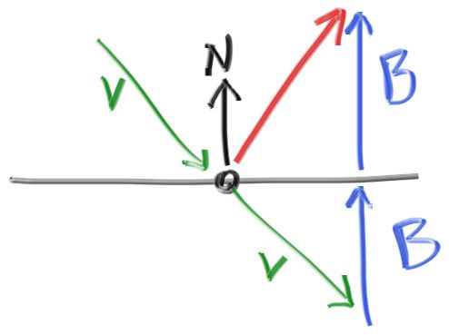
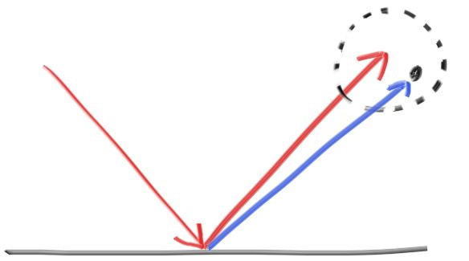

<h1><center>  计算机图形学-2021  实验报告 <center>


<h2><center> 实验一 通过简单的 ray-tracing 来实现对三种不同材质球体的渲染<center>

<h6><center> 计算机93班 2194111772 黄培城<center>


## 一、 实验简介

​		本实验旨在通过实现一个简单的光线追踪算法，让同学们对渲染有个初步理解。同学们需要利用学过的微积分知识与高中物理知识，理解不同光线在不同材质上的作用方式（即光线在物体表面的吸收，反射和折射等等现象），并且可以用程序实现出来。
​		本次实验是通过软件模拟光线的作用方式，所以不需要使用 opengl 库。  

## 二、 实验任务

(1) 本次实验要求实现三种不同的材质的光线追踪算法：漫反射材质、金属材质、玻璃材质。
漫反射材质: 漫反射材质不仅仅接受其周围环境的光线, 还会在散射时使光线变成自己本身的颜色。光线射入漫反射材质后, 其反射方向是随机的。表面越暗, 吸收就越有可能发生。我们可以使用任意的算法生成随机的反射方向, 就能让其看上去像一个粗糙不平的漫反射材质。比如 lambertian 反射器。
金属材质：金属材质带有光泽，介于漫反射材质和镜面材质中间，随机的反射并不太适用于金属材质。我们需要找到能够在视觉上表示出金属材质的某种规律。
玻璃材质：玻璃材质有时也称为透明材质，这种实现不能通过仅仅考虑反射来实现，需要引入对折射光线角度和能量的变化来体现。
本次实验需要按照要求对 material.cpp 文件中的函数进行进行补全  

(2) 使用多线程提高在多核计算机上的运行速度，可以使用已有的多线程库，注意数据依赖。  

## 三、 实验环境

主机操作系统：Windows 10 Home, 64-bit (Build 19043.1348) 10.0.19043

虚拟机平台：VMware® Workstation 16 Pro 16.1.0 build-17198959

虚拟机操作系统：Ubuntu_20.04.2.0_LTS

编译器：gcc version 9.3.0 (Ubuntu 9.3.0-17ubuntu1~20.04) 

cmake版本： version 3.16.3

编辑器：Visual Studio Code 1.62.2


## 四、 原理与代码
### #4.0. 数据结构

- 图像文件格式
	输出的图像文件使用ppm格式。像素按从左到右的像素按行写出，行从上到下写出。每个红/绿/蓝分量的范围从 0 到 255。
	
- 存储几何矢量和颜色的类-vec3
	这是一个三维的向量类。可以用它来存放一个点的颜色（R,G,B），或者存放一个点的坐标（x, y, z）。在文件 vec3.h 中定义了这个类的众多使用函数。
	
- 存储光线的类-ray
	一条光线可以使用一个它通过的点（Origin）和它的方向（Direction）来描述。
	$\mathbf{P}(t)=\mathbf{A}+t\mathbf{b}$
	在文件ray.h和ray.c中定义了它以及一系列函数的实现。
	
- 光线追踪器的实现
	光线追踪器通过发送穿过像素的光线，并计算在这些光线方向上看到的颜色来实现。涉及的步骤是 ：
	(1) 计算从眼睛到像素的光线
	(2) 确定光线与哪些对象相交
	(3) 计算该交点的颜色。
	
- 坐标系的选择
	把“眼睛”（或相机中心）放在 (0,0,0).  y 轴向上，x 轴向右。为了尊重右手坐标系的约定，进入屏幕的是负 z 轴。
	负 z 轴依次穿过相机视口和渲染的图像。
	
- 光线与对象相交的判断——以球体为例
	矢量形式的球体方程为：
	$$
	( \mathbf{P} − \mathbf{C} ) ⋅ ( \mathbf{P} − \mathbf{C} ) =r^2
	$$
	或写出光线$\mathbf{P}(t)=\mathbf{A}+t\mathbf{b}$的完整形式：
	$$
	( \mathbf{A}+t\mathbf{b} − \mathbf{C} ) ⋅ ( \mathbf{A}+t\mathbf{b} − \mathbf{C} ) =r^2
	$$
	移项，得：
	$$
	\mathbf{b}^2\cdot t^2+2\mathbf{b}(\mathbf{A} − \mathbf{C})\cdot t+(\mathbf{A} − \mathbf{C})^2-r^2=0
	$$
	若判别式大于0，则光线与小球相交。
- 表面法线
	建议使用单位长度的法线。
	对于球体，向外的法线是击中点减去中心的方向，即$\mathbf{P-C}$。
	
- 可命中的对象 的类-hitable
	为光线可能会击中的任何东西创建一个“抽象类”，并使一个球体和一个球体列表都算作可以击中的东西。
	
- 可命中的对象 的列表-hitable_list
	存储hittables列表的类。
	依次判断列表中所有物体是否被光线撞到，若有被撞到，则将撞点信息保存在hit_record结构体rec中。rec是可能被写多次的，最终保存的值是后一次的值，也就是离我们最近的撞点。
	
-  对象的添加
	hitable_list： world 所有能撞到的对象
	设定每个物体的材质，并将其一个个加入碰撞列表。	
	
- 抗锯齿
	对于给定的像素，我们在该像素内有多个采样点，并通过每个采样点发送光线，然后对这些光线的颜色进行平均。通过随机数来实现。

### # 4.1. 漫反射材质
不发光的漫射物体仅呈现周围环境的颜色，但它们会用自己的内在颜色进行调制。从漫反射表面反射的光的方向是随机的，同时光也可能被吸收而不是被反射。

为了实现反射方向的随机化，可以在光线与漫反射物体表面的交点 $\mathbf{P}$ 外，设定一个假想的球，球的球心在 $(\mathbf{P+n})$ ，其中 $\mathbf{n}$ 为交点处的法线，球的半径为单位长度。在这个单位球中随机选取一点 $\mathbf{S}$ ，则可以使用 $\mathbf{S-p}$ 作为反射光线的方向。

在单位半径球体中随机选取一个点，可以使用拒绝方法。首先在单位立方体中随机选取一个点，其中 x、y 和 z 的范围都在 -1 到 +1 之间。如果该点在球体之外，则拒绝该点并重试。

```c++
// 随机浮点数生成
float get_random_float(float min, float max) {
  static std::random_device dev;
  static std::mt19937 rng(dev());
  static std::uniform_real_distribution<float> dist(min, max); // distribution in range [min, max]
  return dist(rng);
}
// 三维随机矩阵生成
Vec3 get_random_Vec3(float min, float max){
  return Vec3(get_random_float(min,max),get_random_float(min,max),get_random_float(min,max));
}

Vec3 random_in_unit_sphere() {
// 随机在单位球内采样光线
  while (true) {
    auto p = get_random_Vec3(-1,1);
    if (p.squared_length() >= 1) continue;
    return p; 
  }
}
```
如上的拒绝方法会在单位球偏移中沿表面法线产生随机点。这对应于方向接近法线的概率很高，而在低的角度散射光线的概率较低。这是$cos^3(ϕ)$的分布。

另外可能的角度分布方式是朗伯分布（Lambertian distribution），它的分布为$cos(ϕ)$。它是通过在单位球体**表面**选取随机点来实现的。这可以通过在球体里拾取随机点，然后将其归一化来实现。

```c++
Vec3 random_unit_vector() {
// 归一化的采样
    return unit_vector(random_in_unit_sphere());
}
```

还有一种方法是对远离击中点的所有角度都有一个统一的散射方向，而不依赖于与法线的角度。在采用朗伯漫反射之前许多最早的光线追踪论文都使用了这种漫反射方法。

```c++
Vec3 random_sample_hemisphere(const Vec3 &normal) {
// 随机在单位半球上采样光线
  Vec3 in_unit_sphere = random_in_unit_sphere();
  if (dot(in_unit_sphere, normal) > 0.0) 
    return in_unit_sphere;
  else
    return -in_unit_sphere;
}
```

如果我们生成的随机单位向量与法向量正好相反，则两者之和将为零，这将导致零散射方向向量。这会导致稍后出现糟糕的情况（无穷大和 NaN），因此我们需要在传递之前拦截条件。

```c++
    if (scatter_direction.near_zero())
      scatter_direction = rec.normal;
```

所以漫反射反射方向的代码为：

```c++
bool Material::scatter(const Ray &r, hit_record &rec, Ray &scattered,Vec3 &attenu) {
// rec ：光线与物体相交的点的信息
// scattered：光线与物体作用之后的反射方向
// attenu ：能量衰减
  switch (type) {
  case Diffuse: {
    auto scatter_direction = rec.normal + random_unit_vector();
    // p->s: = rec.p + rec.normal + random_in_square
    // 如果随机生成的向量在所有维度上都非常接近于零，会出错，拦截这样的可能
    if (scatter_direction.near_zero())
      scatter_direction = rec.normal;
    //漫反射的光线
    scattered = Ray(rec.p, scatter_direction);
    //能量衰减系数
    attenu = albedo;
    return true;
    break;
  }
 }
}
```

### # 4.2. 金属材质

对于光滑的金属，光线不会随机散射。光线将从类似于镜面的金属发生反射：



图中的红色光线就是反射的光线。方向为 $\mathbf{v+2B}$ 。
其中 $\mathbf{B}$ 的长度为 $\mathbf{-v \cdot n}$
故反射方向的函数为：

```c++
Vec3 reflect(const Vec3 &v, Vec3 &n) {  
// v:输入光线方向
// n:物体表面法线
// 返回反射光线的位置
  return v - 2*dot(v,n)*n;
}
```

同时，因为金属表面毕竟不是镜面，主观的感觉是磨砂的模糊质感。故可以增加模糊反射的部分，通过对反射光线的末端在一个小球体中选择一个新的端点来随机化反射方向：



球体越大，反射就越模糊。故可以添加一个模糊参数 $fuzz$，它是球体的半径。
对于大球体或掠过的射线，随机化的新的方向可能会散射到表面以下。可以让表面吸收那些光线。

所以金属材料的反射方向为：

```c++
// r:入射光线方向
// fuzz：模糊参数
case Metal: {
    Vec3 reflected = reflect(unit_vector(r.Direction()), rec.normal);
    scattered = Ray(rec.p, reflected + fuzz*random_in_unit_sphere());
    attenu = albedo;
    return (dot(scattered.Direction(), rec.normal) > 0);
    // return true;
    break;
}
```

### # 4.3. 玻璃材质

当光线照射到透明材料或者玻璃材质时，会分裂成反射光线和折射（透射）光线。可以对每条光线通过在反射或折射之间随机选择来处理这个问题，同时每次入射生成一个散射光线。
#### #4.3.1 折射
折射由斯涅尔定律描述：
$$
η⋅sinθ=η′⋅sinθ′
$$
其中， $\theta ,\theta'$ 为光线与法线的夹角，$\eta,\eta'$ 是折射率.

在表面的折射侧有一条折射光线 $\mathbf{R'}$ 和一个法向量$\mathbf{n'}$，夹角为$\mathbf{\theta'}$。可以将$\mathbf{R'}$正交分解为平行和垂直$\mathbf{n'}$ 的两部分：
$$
\mathbf{R'_⊥}=\frac{\eta}{\eta'}(\mathbf{R}+\cos\theta\mathbf{n})
\\\mathbf{R'_∥}=-\sqrt{1-|\mathbf{R'_⊥}|^2\mathbf{n}}
$$
所以：
$$
\mathbf{R'_⊥}=\frac{\eta}{\eta'}(\mathbf{R}+(-\mathbf{R\cdot n})\mathbf{n})
$$
所以折射方向的函数为：

```c++
Vec3 refract(Vec3 &v, Vec3 &n, float ior) {
// ior:物体的折射率
// 返回一个折射后的光线
  auto cos_theta = fmin(dot(-v, n), 1.0);
  // 垂直方向
  Vec3 r_out_perp =  ior * (v + cos_theta*n);
  // 平行方向
  Vec3 r_out_parallel = -sqrt(fabs(1.0 - r_out_perp.squared_length())) * n;
  return r_out_perp + r_out_parallel;
}
```
#### #4.3.2 全反射
在光线处于玻璃物体内部时，可能会发生全反射。当
$$
ior \cdot \sin \theta > 1
$$
时，发生全反射。
由于玻璃球模型中光线可能发生折射，也肯能发生反射。但此时光线不可能发生折射，故必定发生反射。

#### #4.3.3 施里克近似 

真正的玻璃具有随角度变化的反射率，就像以陡峭的角度看窗户时，它似乎变成了一面镜子。精确描述的方程非常复杂，所以我们使用 Christophe Schlick 的多项式近似：

```c++
float schlick_reflectance(float cos, float ior) {
  // Use Schlick's approximation for reflectance.
  auto r0 = (1-ior) / (1+ior);
  r0 = r0*r0;
  return r0 + (1-r0)*pow((1 - cos),5);
}
```

由于玻璃不吸收任何光，故衰减系数始终为1。

因此玻璃材料的反射代码为：
```c++
case Dielectric: {
    // 玻璃不吸收任何光，故衰减系数始终为1
    attenu = Vec3(1.0, 1.0, 1.0);
    // 检查入射方向是从那边向那边
    rec.set_face_normal(r,rec.normal);
    double refraction_ratio = rec.front_face ? (1.0/ior) : ior;
    Vec3 unit_direction = unit_vector(r.Direction());
    double cos_theta = fmin(dot(-unit_direction, rec.normal), 1.0);
    double sin_theta = sqrt(1.0 - cos_theta*cos_theta);

    bool cannot_refract = refraction_ratio * sin_theta > 1.0;   //全反射条件
    Vec3 direction;
    // 除了全反射（必定折射的光线外），正常光线可能反射也可能折射，限度为随机数：
    if (cannot_refract || schlick_reflectance(cos_theta, refraction_ratio) > get_random_float(0,1))
        direction = reflect(unit_direction, rec.normal);
    else
        direction = refract(unit_direction, rec.normal, refraction_ratio);

    scattered = Ray(rec.p, direction);

    return true;
    break;
}
```


### # 4.4. 光线着色函数

ray_color函数是递归的。当它无法击中任何东西时停止递归。然而，在某些情况下，这可能需要很长时间。为了防止出现这种情况，我们限制了最大递归深度 $depth$，在最大深度处不返回任何光贡献.
```c++
Vec3 ray_color(const Ray &r, hitable *world, int depth) {
  hit_record rec;
  //如果光线到达反射次数,停止
  if (depth <= 0)
    return Vec3(0,0,0);

  //如果光线与物体相交,设置反射后的颜色
  if (world->hit(r, 0.001, infinity, rec)) {
    Ray scattered;
    Vec3 attenuation;
    if (rec.mat->scatter(r, rec, scattered, attenuation))
      return attenuation * ray_color(scattered, world, depth-1);
    return Vec3(0,0,0);
  }
  //如果光线与任何物体不相交,设置背景颜色
  Vec3 unit_direction = unit_vector(r.Direction());
  auto t = 0.5*(unit_direction.y() + 1.0);
  return (1.0-t)*Vec3(1.0, 1.0, 1.0) + t*Vec3(0.5, 0.7, 1.0);
}

```

### # 4.5. 多线程

使用OpenMP中的 \#pragma omp parallel for 指令进行多线程操作：

```c++
#pragma omp parallel for     // 接下来的for循环将被多线程执行
for (int j = H - 1; j >= 0; j--) {
    ...
}
```

由于之前图片文件的像素写入是按照顺序进行的，使用多线程执行时不能保证像素顺序写入。故需要计算每个需要写入的像素在目标文件中的位置，通过位置写入像素。

```c++
int tmp = 0;
#pragma omp parallel for     //接下来的for循环将被多线程执行
for (int j = H - 1; j >= 0; j--) {
    ...
    // sqrt是伽马校正
    p[tmp] = int(255.99 * sqrt(col[0]));
    p[tmp+1] = int(255.99 * sqrt(col[1]));
    p[tmp+2] = int(255.99 * sqrt(col[2]));
}
```

## 五、 实验结果

### # 5.1. 漫反射材质


### # 5.2. 金属材质


### # 5.3. 玻璃材质


## #六、 心得体会

本次实验收获很大，不仅学习到了光线追踪的基本方法，自己一步步的从无到有编程实现了基本的光线追踪算法，对这部分的知识掌握得更为透彻。而且还接触了完整的一个项目，学习到了一个项目是如何构建而完成的，也补充了很多开发所必备的基本知识与能力，比如linux的使用，虚拟机的使用，cmake使用，并行库的使用，版本同步软件的使用，等等等等。与此同时debug的能力也有了很大的提高。在课本中学的东西得到了一次全面的实践，对于课内学到的知识是一次很好的巩固以及提高。